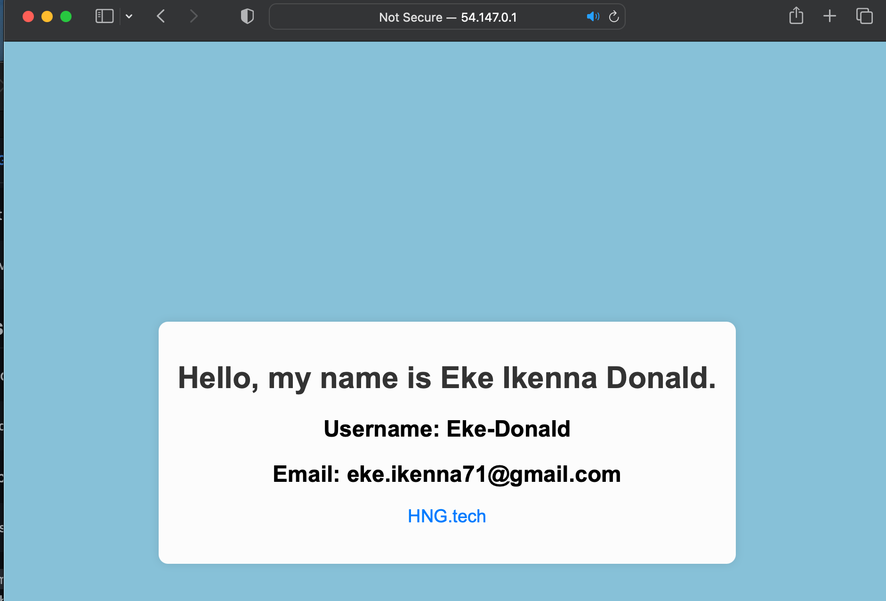

# Deploying a Static Website on AWS

The following steps are taken to Deploy a Static Website on AWS:

## Prerequisites

* Create an AWS account if you don't have one, [sign up here](https://signin.aws.amazon.com/signup?request_type=register).

## Step 1: Spin up an EC2 Instance on AWS

Click on the `Search Bar`, type **EC2** and click on it.

Click on `Launch instance` button.

Use the following parameters when configuring the EC2 Instance then click on the `Launch instance` button:
1. Name of Instance: web-server
2. AMI: Ubuntu Server 22.04 LTS(HVM), SSD Volume Type
3. Instance Type: t2.micro
4. New Key Pair Name: run
5. Key Pair Type: RSA
6. Private Key File Format: .pem
7. New Security Group: Web01
8. Inbound Rules: Allow Traffic From Anywhere On **Port 80** and only Traffic from your Workstation (i.e. My IP) on **Port 22**.

## Step 2: Connect to EC2 Instance using SSH

On the EC2 Dashboard, click on the `Instances (running)` tab.

Click on the `Instance ID` of the Running Instance.


Click on the `Connect` button of the Instance ID summary.


Click on `SSH Client` tab, the highlighted commands in the image below are used to **SSH** into the EC2 Instance.


On you terminal, run the following command `cd Downloads` to go to the location of the `.pem` private key file.

Run the code shown below to change the file permissions for the `.pem` private key file:

```sh
sudo chmod 0400 <private-key-name>.pem
```

Finally, connect to the EC2 Instance by running the command shown below:

```sh
ssh -i <private-key-name>.pem ubuntu@<Public-IP-address>
```


## Step 3: Installing Apache

Update the list of packages in the package manager.

```sh
sudo apt update
```

Run `apache2` package installation.

```sh
sudo apt install apache2 -y
```


Run the `systemctl status` command to check if apache2 is running, if it is green then apache2 is running correctly. Your first webserver has been launched.

```sh
sudo systemctl status apache2
```


Validate if the webserver can be accessed locally using the command shown below:

```sh
curl localhost
```


## Step 4: Configure and Update the Static Website Content

Run the following command to update the default `index.html` file to display your **name**, **username**, **email** and [**HNG URL**](http://hng.tech).

```sh
sudo cat <<EOF | sudo tee /var/www/html/index.html
<!DOCTYPE html>
<html lang="en">
<head>
    <meta charset="UTF-8">
    <meta name="viewport" content="width=device-width, initial-scale=1.0">
    <title>Personal Link</title>
    <style>
        body {
            font-family: Arial, sans-serif;
            background-color: #87c1d8;
            display: flex;
            justify-content: center;
            align-items: center;
            height: 100vh;
            margin: 0;
        }
        .container {
            background: #fcfcfc;
            padding: 20px;
            border-radius: 10px;
            box-shadow: 0 0 10px rgba(0, 0, 0, 0.1);
            text-align: center;
        }
        h1 {
            color: #333;
        }
        p {
            font-size: 1.2em;
        }
        a {
            color: #007BFF;
            text-decoration: none;
            transition: color 0.3s;
        }
        a:hover {
            color: #f9f9f9;
        }
    </style>
</head>
<body>
    <div class="container">
        <h1>Hello, my name is <strong>Eke Ikenna Donald</strong>.</h1>
        <h2>Username: <strong>Eke-Donald</strong></h2>
        <h2>Email: <strong>eke.ikenna71@gmail.com</strong></h2>
        <p><a href="https://hng.tech/" target="_blank">HNG.tech</a></p>
    </div>
</body>
</html>
EOF
```

Restart the apache service to update changes.

```sh
sudo systemctl restart apache2
```

## Step 5: Validate the Static Website Hosted on AWS

On your EC2 Dashboard, click on the **Instance ID** and copy `Public IP Address` of your EC2 Instance.


Go to your web browser and paste the `Public IP Address` of your EC2 Instance.

