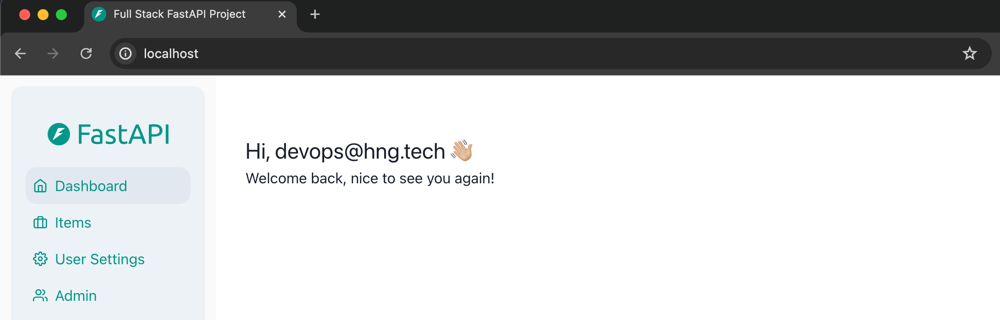
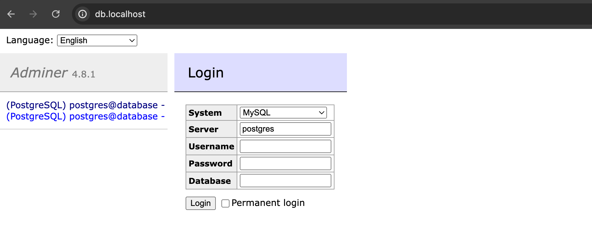
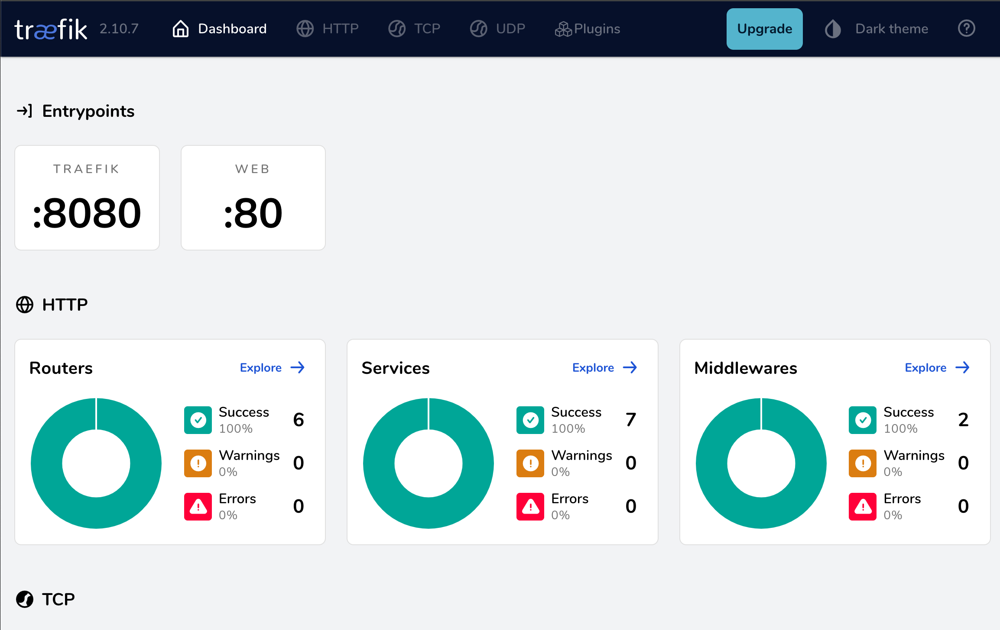

# Full-Stack FastAPI and React Application Deployment

Welcome to the Full-Stack FastAPI and React template repository. This repository serves as a demo application for showcasing how to set up and run a full-stack application with a FastAPI backend and a ReactJS frontend using ChakraUI.

## Project Structure

The repository is organized into two main directories:

- **frontend**: Contains the ReactJS application.
- **backend**: Contains the FastAPI application and PostgreSQL database integration.

Each directory has its own README file with detailed instructions specific to that part of the application.

## Getting Started

To get started with this template, please follow the instructions in the respective directories:

- [Frontend README](./frontend/README.md)
- [Backend README](./backend/README.md)

## Implementation of the Dockerized Full Stack Web Application Deployment

After completing the steps above, the following steps are taken to dockerize the application:

### Step 1: Build a Frontend Image in the `frontend` Directory

- Write a `Dockerfile` that contains all the **Node** dependencies and executables needed to install and run the **React** frontend.

```sh
# Stage 1: Build the React app
FROM node:18 AS build

ARG VITE_API_URL=http://localhost:8000

ENV VITE_API_URL=$VITE_API_URL

# Set the working directory inside the container
WORKDIR /app

# Copy the package.json and package-lock.json to the working directory
COPY package*.json .

# Install dependencies
RUN npm install

# Copy the rest of the application code to the working directory
COPY . .

RUN npm install -g typescript

# Build the React app for production
RUN npm run build

# Check the output of the build step
RUN echo "Build output:" && npm run build

# Check the contents of the /app directory
RUN echo "Contents of /app:" && ls -la /app

# Check the contents of the build directory
RUN echo "Contents of /app/build:" && ls -la /app/dist

# Stage 2: Serve the React app with Nginx
FROM nginx:alpine

# Copy the built React app from the previous stage to the nginx web root
COPY --from=build /app/dist /usr/share/nginx/html

# Expose port 80
EXPOSE 80

# Start the nginx server
CMD ["nginx", "-g", "daemon off;"]
```

- Test if the image can build successfully by running the command below:

```sh
docker build -t <image_name> .
```

### Step 2: Build a Backend Image in the `backend` Directory

- Write a `Dockerfile` that contains all the **Python Poetry** dependencies and executables needed run the **FastAPI** backend.

```sh
FROM python:3.10-slim

USER root

WORKDIR /app

# Install necessary packages
RUN apt-get update && apt-get install -y curl wait-for-it

# Install Poetry
RUN curl -sSL https://install.python-poetry.org | python3 -

# Set environment variables for Poetry
ENV PATH="/root/.local/bin:$PATH"
ENV DB_HOST=database
ENV DB_PORT=5432

# Copy only the necessary files first to leverage Docker cache
COPY pyproject.toml poetry.lock /app/

# Install project dependencies
RUN poetry install

# Copy the rest of the application files
COPY . /app

ENV PYTHONPATH=/app

# Copy the prestart script
COPY prestart.sh /app/prestart.sh
RUN chmod +x /app/prestart.sh

# Command to run the application
CMD cd /app && \
    wait-for-it ${DB_HOST}:${DB_PORT} -- poetry run bash ./prestart.sh && \
    poetry run uvicorn app.main:app --host 0.0.0.0 --port 8000
```

- Test if the image can build successfully by running the command below:

```sh
docker build -t <image_name> .
```

- Make the necessary changes in the `.env` files which will be referenced by `docker-compose` to build the application.

### Step 3: Create and Configure the `docker-compose.yaml` file

The following steps are taken to configure the `docker-compose.yaml` file:

- Reference the Dockerfiles created in the `backend` and `frontend `directories to run as containers for the **backend** and **frontend** services respectively.

- Configure the **PostgresSQL** database as a container and ensure it is properly connected to the `backend` service.

- Configure **Traefik** as a container which serves the following:
    1. The frontend and backend on the same host machine `port 80`.
    2. The frontend on the root `/`.
    3. Proxy `/api` on the backend to `/api` on the main domain.
    4. Proxy `/docs` on the backend to `/docs` on the main domain.
    5. Proxy `/api` on the backend to `/api` on the main domain.

- **Traefik** as runs as the Proxy Manager and is accessible via the subdomain `proxy.domain`.

- Configure **Adminer** to run on `port 8080`, ensure it is accessible via the subdomain `db.domain` and properly connected to the **PostgresSQL** database.

_The final configuration of the [docker-compose.yaml](./docker-compose.yaml) file_.

### Step 4: Build and Run the Containerized Application

- Run the following command to build and the run the application:

```sh
docker-compose build --no-cache
docker-compose up -d
```

### Step 5: Verifying the Application

After a successful run, go to your web browser and paste the following urls:

```sh
http://localhost
```



```sh
http://db.localhost
```



```sh
http://proxy.localhost
```



_**Note**: The login details can be found in the `.env` file in the `backend` directory._

## Deploying & Hosting The Application on EC2

### Prerequisite
- a domain name (i.e. used for DNS configuration)

The Dockerized application needs to be deployed on an AWS `EC2 Instance`. On AWS, `Route53` will be leveraged for DNS Routing. The steps taken to achieve this are stated below:

### Step 1: Install Docker on the EC2 Instance and clone the [repository](https://github.com/ekedonald/Stage-2-Dockerized-Full-Stack-Application.git)

- Spin up an EC2 Instance and run the commands to install `docker` and `docker-compose`.

```sh
cat <<EOF | tee docker.sh
#!/bin/bash
sudo apt-get update
sudo apt-get -y install ca-certificates curl
sudo install -m 0755 -d /etc/apt/keyrings
sudo curl -fsSL https://download.docker.com/linux/ubuntu/gpg -o /etc/apt/keyrings/docker.asc
sudo chmod a+r /etc/apt/keyrings/docker.asc

# Add the repository to Apt sources:
echo \
  "deb [arch=$(dpkg --print-architecture) signed-by=/etc/apt/keyrings/docker.asc] https://download.docker.com/linux/ubuntu \
  $(. /etc/os-release && echo "$VERSION_CODENAME") stable" | \
  sudo tee /etc/apt/sources.list.d/docker.list > /dev/null
sudo apt-get update

sudo apt-get install -y docker-ce docker-ce-cli containerd.io docker-buildx-plugin docker-compose-plugin

sudo usermod -aG docker $USER

newgrp docker
EOF
```
_This is a bash script to install docker_.

```sh
bash docker.sh && sudo apt install docker-compose -y
git clone <dockerized-full-stack-application-url>
```

### Step 2: Update the `docker-compose.yaml` file with SSL & Subdomain Redirects

- Traefik offers a codebase approach directly in the `docker-compose.yaml` file and that's why it is the preferred Proxy Manager for implementing this project. 

- Configure Traefik to redirect `HTTP`and `www` requests to `HTTPS` and `non-www`.

- Ensure that the `frontend`, `backend`, and `adminer `routers are listening on the `websecure` entry point and using the TLS certresolver `myresolver`.

- _**Note**: The domain names must be consistent in the `docker-compose.yaml` file and `.env` files to avoid errors_.

### Step 3: Configure & Add DNS Records

- On the AWS console, navigate to `Route 53` and create a `Public Hosted` zone.

- Enter your domain name and click on create hosted zone.

- Copy the 4 values of **NS Records** in the hosted zone and paste them on the **DNS Nameserver Records** on the Web Hosting platform your domain was purchased.

- On the newly created hosted zone, create `A Record` for each subdomain routing to the **Public IPv4 Address** of the `EC2 Instance`:
    1. yourdomain.com
    2. www.yourdomain.com
    3. db.yourdomain.com
    4. proxy.yourdomain.com

_**Note**: After creation, there will be a prompt that allows you view status of the records to verify if they have been synchronized_.

- DNS changes can take some time to propagate. [WhatsMyDNS](https://www.whatsmydns.net/) validates if the DNS records have propagated globally, use it to test the 4 domains.

### Step 4: Redeploy the Application

- SSH into the EC2 Instance and cd into the directory of the repo you clone.

- Run the following command to deploy the application:

```sh
docker-compose up -d
```

- The application is running and can be assessed by anyone connected to the internet once they have your domain name.